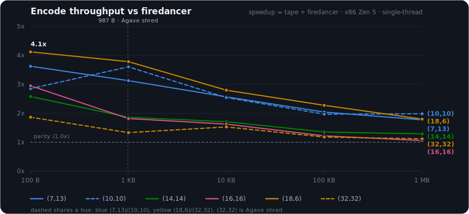

# tape-reed-solomon

[](https://crates.io/crates/tape-reed-solomon)
[](https://docs.rs/tape-reed-solomon)
[](LICENSE)

Pure-Rust Reed-Solomon erasure coding over **GF(2^8)** (primitive polynomial
`0x11d`), with SIMD-accelerated field arithmetic.

## Performance

Single-thread encode throughput on x86 (Zen 5 Turin, GFNI + AVX-512), as a multiple
of firedancer's `fd_reedsol`, across the five generated shapes and shard sizes:



tape leads at every shape and size, converging toward parity only at 1 MB where both go
DRAM-bound. Full tables (NEON, wasm, reconstruct, and the run-by-run history) are in
[`BENCH-RESULTS.md`](BENCH-RESULTS.md).

## API

```rust
let rs = ReedSolomon::new(data_shards, parity_shards)?;
rs.encode(&mut shards)?;        // shards: data shards followed by parity shards
rs.reconstruct(&mut shards)?;   // fills in missing shards in place
```

`new`, `encode`, `verify`, `reconstruct`, `reconstruct_data`, plus batched and
prepared entry points:

- `encode_rows` / `encode_rows_into`: encode whole contiguous rows in a single
  fused pass, allocating or into a caller buffer.
- `reconstruct_rows`: rebuild missing rows inside one contiguous buffer.
- `prepare_decode`: build a `PreparedDecoder` for one erasure pattern; it owns
  the inverted decode matrix and kernel tables, so decoding many stripes with
  the same pattern pays for the inversion once.

`reconstruct` also caches decode plans per erasure pattern internally, so
repeated calls with the same pattern skip the matrix inversion either way.
Encode, verify, and every reconstruct path run through the fused kernels.

## Backends

Field math routes through `gf::mul_slice` / `gf::mul_slice_xor`, and the bulk
paths through per-architecture fused multi-output kernels. The scalar kernel
is the reference; every SIMD kernel builds its tables from `galois::mul`, and
per-backend differential tests pin them byte-identical to scalar.

Encoding picks between three byte-identical routes per shape. Shapes on the
generated list (`GENERATED_SHAPES`, currently (7,13), (10,10), (14,14),
(16,16), and (18,6)) run generated Lin-Chung-Han FFT programs with a
fraction of the schoolbook multiplies, fully register-resident on NEON, on
GFNI hosts (64-byte strips where AVX-512 is present), and on wasm simd128.
The coverage policy costs one line per shape: every shape that ships gets
added to the generator list and registered, and the byte-identity tests do
the rest. Any other shape is compiled at construction into a staged FFT
program (block transforms plus glue over a stack register file) and routed
there when measurement says it wins, currently power-of-two data counts
with a decisive multiply saving. Everything else, and every sub-strip
length, takes the fused matrix kernels. All three interpolate through points 0..k-1
and evaluate at points k..n-1, exactly the code the matrix construction
defines, so parity never depends on the route; `ReedSolomon::encode_route`
reports the choice for a given shard length.

| arch    | backend                                   | kernel              |
|---------|-------------------------------------------|---------------------|
| x86_64  | GFNI > AVX-512BW > AVX2 > SSSE3 > scalar   | `src/gf/x86.rs`     |
| aarch64 | NEON (sha3 fold when available)           | `src/gf/neon.rs`    |
| wasm32  | simd128 (under `+simd128`)                | `src/gf/wasm128.rs` |
| other   | scalar                                    | `src/gf/scalar.rs`  |

## Cargo features

The default build detects CPU features at runtime and falls back gracefully,
so it is safe on any host. A feature pins one kernel at build time instead,
which is useful for a homogeneous fleet, a single-kernel benchmark, or a
smaller binary. A pinned kernel the target CPU lacks faults (illegal
instruction) at runtime, so pin only what the whole fleet supports.

| feature  | backend                          |
|----------|----------------------------------|
| `scalar` | portable, no SIMD (any target)   |
| `ssse3`  | x86_64 SSSE3 (128-bit)           |
| `avx2`   | x86_64 AVX2 (256-bit)            |
| `avx512` | x86_64 AVX-512BW (512-bit)       |
| `gfni`   | x86_64 GFNI + AVX-512            |
| `neon`   | aarch64 NEON                     |

Combining `scalar` with anything, or two x86 pins with each other, is a
compile error: cargo unifies features across a workspace, and two dependents
pinning different kernels would otherwise silently run the narrowest one.
Pairing an x86 pin with `neon` stays legal for multi-target workspaces; each
pin only applies on its own architecture.

On wasm32 the backend is chosen by the `+simd128` target-feature:

```sh
RUSTFLAGS="-C target-feature=+simd128" cargo build --target wasm32-unknown-unknown
```

## Testing

```sh
cargo test    # unit tests, per-backend differential-vs-scalar, wire-compat gate
```

`tests/parity.rs` verifies byte-identical output against an independent
reference implementation across 8 shard shapes x 3 sizes, plus
cross-implementation reconstruct, round-trip, and the prepared-decoder and
contiguous-rows paths against reference-encoded stripes. On x86 hosts
`cargo test` exercises whichever of GFNI/AVX-512/AVX2/SSSE3 the CPU supports;
on aarch64, NEON.

Benchmarks and cross-implementation harnesses live under `benches/`.

## License

Apache-2.0; see `LICENSE` and `THIRD-PARTY-NOTICES.md`.
